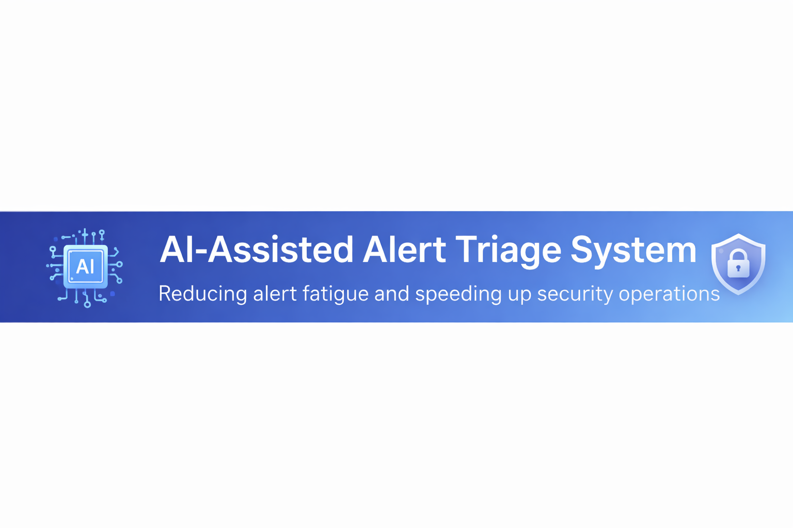
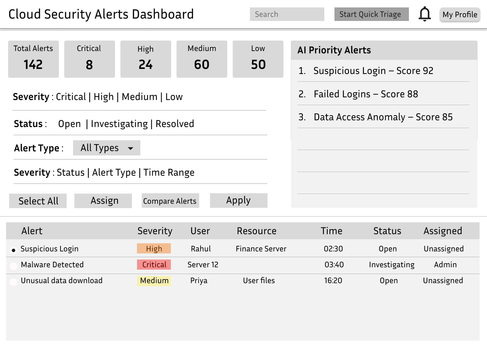

  

# AI-Assisted Alert Triage System

Improving security operations by reducing alert fatigue and enabling faster alert investigation for SOC analysts.

---

# Problem Statement

Security analysts monitoring cloud environments deal with a large number of alerts every day. Many of these alerts are repetitive or low priority, making it difficult to quickly identify which incidents truly require attention.

This often leads to **alert fatigue, slower investigations, and the risk of missing critical threats.**

This solution improves the alert triage workflow by helping analysts:

• Quickly surface high-risk alerts  
• Review important information in a focused interface  
• Act faster through AI-assisted prioritization and rapid triage tools  

---

# User Persona

## Security Operations Analyst (SOC Analyst)

SOC analysts monitor security alerts and investigate suspicious activity across cloud systems. They often operate in **high-pressure environments** where large volumes of alerts must be reviewed quickly.

They need tools that help them:

• Prioritize alerts effectively  
• Understand alert context quickly  
• Act efficiently without navigating complex workflows  

This design focuses on **reducing alert fatigue** and enabling analysts to process alerts faster and respond to potential threats more effectively.

---

# Interactive Prototype

🔗 **[Open the Figma Design](https://www.figma.com/design/fjCl7Z0iw5DevlpbEXhBfD/Alert-Triage-Workflow?node-id=0-1&t=MdtL47Ql0lMxPqkW-1)**

---

# Product Screens

## AI-Prioritized Alert Dashboard

  

The dashboard highlights alerts that require immediate attention using **AI-generated risk scores**.  
Instead of scanning a long list of alerts, analysts can quickly focus on **high-risk incidents first**.

This reduces noise and improves investigation efficiency.

---

## Quick Triage Mode

  

Quick Triage Mode presents alerts in a **focused alert card interface** where analysts review alerts one at a time.

The card surfaces the most important signals such as:

• Severity  
• User information  
• Location  
• Risk score  
• Similar alerts in the last 24 hours  

Analysts can rapidly take actions such as **Investigate, Assign, Close, or Compare alerts**, helping them process alerts significantly faster.

---

# Proposed Features

The design improves the alert triage experience by helping analysts quickly identify and act on the most important alerts.

### 1. AI-Prioritized Alerts (Dashboard)

The dashboard highlights alerts that require immediate attention using **AI-generated risk scores**, allowing analysts to focus on high-risk incidents first.

---

### 2. Quick Triage Mode

Quick Triage Mode provides a **simplified alert card interface** where analysts review alerts one at a time.

The interface surfaces key signals such as:

• Severity  
• User details  
• Location  
• Risk score  

and enables rapid response actions.

---

### 3. Similar Alerts View

The triage card includes a **“View Similar Alerts”** option that allows analysts to quickly review alerts triggered by similar patterns.

This helps detect **coordinated attacks or repeated suspicious activity**.

---

### 4. Investigation View with AI Insights

When deeper analysis is required, analysts can open a detailed investigation screen showing:

• User details  
• Device and location information  
• Activity timelines  
• Historical behavior  

An **AI Insights panel** summarizes the risk explanation and suggests possible response actions.

---

# Feature Prioritization

The design prioritizes features that directly address the biggest challenge in security operations: **alert fatigue and slow triage workflows.**

### High Priority

• AI-prioritized alerts  
• Quick Triage Mode  

These significantly reduce the time required to identify and review critical alerts.

### Medium Priority

• Similar Alerts view  

This helps analysts detect patterns and investigate related incidents more efficiently.

### Supporting Features

• Investigation view  
• AI insights  

These provide deeper context when analysts perform full investigations.

---

# Success Metrics

The effectiveness of this solution can be measured using the following metrics:

• **Average Time to Triage an Alert**  
• **Alert Resolution Time**  
• **Alert Fatigue Reduction**  
• **False Positive Handling Time**  
• **Analyst Productivity**

Improvement in these metrics indicates that analysts can process alerts faster, focus on high-risk incidents, and respond more effectively to potential security threats.
